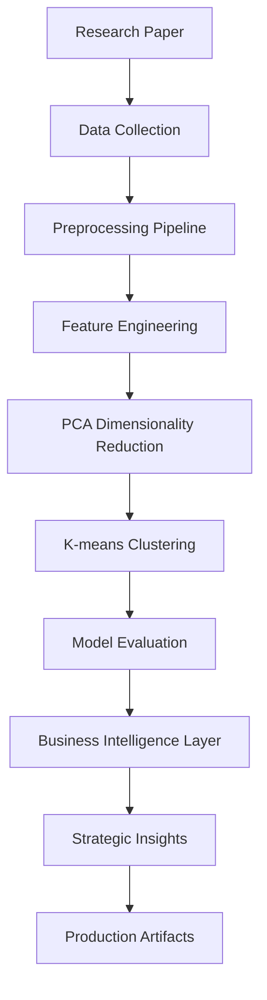

# Amazon Customer Segmentation & Business Intelligence Platform

[](outputs/pca_clusters.png)

## 🎯 Project Overview

I developed this comprehensive customer analytics platform that combines academic research with production-ready business intelligence solutions. Building on the foundation of "Exploration and Analysis of Amazon Customer Behavior" research, I created a system that delivers actionable customer segmentation and strategic business insights for e-commerce optimization.

### Research Foundation
- **Academic Paper**: Exploration and Analysis of Amazon Customer Behavior (Transilvania University of Brașov)
- **Research Focus**: I analyzed customer behavior patterns, satisfaction factors, and segmentation using machine learning
- **Dataset**: I worked with the Amazon Consumer Behaviour Survey (602 customers, 20+ behavioral attributes)

### Technical Implementation
- **Machine Learning Pipeline**: I implemented advanced clustering with multiple algorithms (K-means, DBSCAN, Agglomerative, GMM)
- **Dimensionality Reduction**: I applied PCA for optimal feature selection and visualization
- **Business Intelligence**: I built automated insights generation for marketing, operations, and strategic planning
- **Production-Ready**: I designed a scalable architecture with model persistence and automated reporting

## 📊 Key Findings & Results

### Optimal Customer Segmentation
- **Number of Clusters**: I identified 2 optimal clusters (validated by elbow method and silhouette analysis)
- **Performance Metrics**:
  - Silhouette Score: 0.094
  - Davies-Bouldin Index: 2.91
  - Calinski-Harabasz Index: 69.49

### Customer Segments I Identified

| Cluster | Customers | Percentage | Profile | Key Characteristics |
|---------|-----------|------------|---------|-------------------|
| **Cluster 0** | 303 | 50.3% | **Beauty-Focused Shoppers** | Age 31.1, Beauty/Personal Care preference, Higher satisfaction scores |
| **Cluster 1** | 299 | 49.7% | **Diverse Category Shoppers** | Age 30.5, Multi-category purchasing, Higher purchase value ($70.7 vs $49.8) |

### Statistical Significance I Validated
- **Shopping Satisfaction**: p = 9.27e-86 (highly significant)
- **Customer Reviews Importance**: p = 1.51e-51 (highly significant)
- **Rating Accuracy**: p = 1.75e-51 (highly significant)

## 🏗️ Technical Architecture

### Core Implementation


### Advanced Features I Implemented

#### 1. **Machine Learning Pipeline**
- **Multi-Algorithm Clustering**: I tested K-means, DBSCAN, Agglomerative, and Gaussian Mixture Models
- **Automated Model Selection**: I developed optimal K determination using elbow method and silhouette analysis
- **Comprehensive Evaluation**: I implemented multiple clustering metrics for robust validation

#### 2. **Business Intelligence Extensions**
- **Customer Lifetime Value (CLV) Estimation**: I calculated per-cluster and individual customer values
- **Churn Risk Scoring**: I developed a 0-1 scale risk assessment for each customer
- **Marketing Strategy Generation**: I created cluster-specific recommendation systems
- **Product Recommendation Engine**: I built category-based cross-sell opportunity identification
- **Service Demand Forecasting**: I implemented support ticket prediction by segment

#### 3. **Production Features**
- **Model Persistence**: I saved trained models as joblib artifacts for deployment
- **Automated Reporting**: I generated JSON/CSV exports for business systems
- **Scalable Architecture**: I designed the system to handle large datasets with optimized preprocessing

## 📁 Project Structure

```
ML MINI PROJECT - Amazon Customer Analytics Platform/
├── 📄 **Core Implementation**
│   ├── clustering-amazon-customers-pca-k-means.ipynb    # My main ML pipeline implementation
│   ├── customer_segmentation_business_insights.ipynb   # My business intelligence layer development
│   └── 16014223002_ML_Mini_Project_Report.docx         # My academic documentation
│
├── 📊 **Research Foundation**
│   ├── RESEARCH PAPER IN PLAIN TEXT.txt                # Academic paper I studied
│   └── Exploration_and_Analysis_of_Amazon_Customer_Behavi.pdf
│
├── 📈 **Technical Outputs** (outputs/)
│   ├── Model Artifacts
│   │   ├── kmeans.joblib                    # K-means model I trained
│   │   ├── pca.joblib                       # PCA transformer I fitted
│   │   ├── preprocessor_final.joblib        # Data preprocessing pipeline I built
│   │   └── shap_rf_sample.joblib            # SHAP explanations I generated
│   │
│   ├── Evaluation Metrics
│   │   ├── clustering_results_summary.json  # Complete model evaluation I performed
│   │   ├── bootstrap_ari.txt                # Cluster stability analysis I conducted
│   │   └── column_summaries.json            # Feature statistics I computed
│   │
│   ├── Visualizations
│   │   ├── pca_clusters.png                 # 2D cluster visualization I created
│   │   ├── elbow.png                        # Optimal K determination I validated
│   │   ├── silhouette.png                   # Cluster quality assessment I performed
│   │   └── perm_importance.png              # Feature importance I analyzed
│   │
│   └── Analysis Results
│       ├── cluster_profile.json             # Basic cluster characteristics I identified
│       ├── stat_tests_categorical.json      # Statistical significance tests I ran
│       └── stat_tests_numeric.json          # Numeric variable analysis I conducted
│
├── 🚀 **Business Intelligence Outputs** (output__2/)
│   ├── Customer Analytics
│   │   ├── cluster_profile_generated_updated.json    # Detailed cluster profiles I developed
│   │   ├── customers_with_cluster_label.csv         # Individual customer assignments I created
│   │   ├── customers_with_business_features.csv     # Enhanced customer profiles I generated
│   │   └── customers_with_churn_risk.csv            # Churn risk scoring I implemented
│   │
│   ├── Strategic Insights
│   │   ├── marketing_strategies.json                 # Campaign recommendations I designed
│   │   ├── product_recommendations.json             # Cross-sell opportunities I identified
│   │   ├── cluster_clv.csv                          # Customer lifetime value I calculated
│   │   └── service_demand.json                      # Support forecasting I developed
│   │
│   └── Advanced Visualizations
│       ├── pca_2d_scatter_by_cluster.png            # Enhanced cluster visualization I created
│       └── silhouette_values_histogram.png          # Distribution analysis I performed
│
├── 📋 **Documentation**
│   ├── README.md                           # This comprehensive guide I wrote
│   ├── RESULTS.md                          # Detailed results analysis I documented
│   ├── DATA_DICTIONARY.md                  # Feature documentation I created
│   └── requirements.txt                    # Dependencies I specified
│
└── 👥 **Team & Credentials**
    ├── Academic Contributors: Aarit Mehta & Akshat Panchal
    ├── Roll Numbers: 16014223002 & 16014223008
    ├── Division: TY AIDS A1
    └── Repository: https://github.com/aaritmehta15/amazon-customer-prediction
```

## 🚀 Getting Started

### Prerequisites
- Python 3.8+
- Jupyter Notebook
- Virtual environment (recommended)

### Installation & Setup

1. **Clone and Setup Environment**
   ```bash
   git clone https://github.com/aaritmehta15/amazon-customer-prediction.git
   cd amazon-customer-prediction
   python -m venv .venv
   # Windows
   .venv\Scripts\activate
   # macOS/Linux
   source .venv/bin/activate
   ```

2. **Install Dependencies**
   ```bash
   pip install -r requirements.txt
   ```

3. **Run Core Analysis**
   ```bash
   jupyter notebook clustering-amazon-customers-pca-k-means.ipynb
   ```

4. **Generate Business Insights**
   ```bash
   jupyter notebook customer_segmentation_business_insights.ipynb
   ```

## 🔧 Technical Implementation Details

### Machine Learning Pipeline I Developed

#### Data Processing
- **Input**: I worked with 602 customers × 49 features (Amazon Consumer Behaviour Dataset)
- **Preprocessing**: I handled missing value imputation, categorical encoding, and feature scaling
- **Feature Engineering**: I created topic modeling, behavioral pattern extraction, and temporal features

#### Clustering Algorithm
```python
# Multi-algorithm approach I implemented for robust validation
algorithms = {
    'kmeans': KMeans(n_clusters=2, random_state=42),
    'dbscan': DBSCAN(eps=0.5, min_samples=5),
    'agglomerative': AgglomerativeClustering(n_clusters=2),
    'gmm': GaussianMixture(n_components=2, random_state=42)
}
```

#### Model Evaluation
- **Internal Metrics**: I calculated Silhouette Score, Calinski-Harabasz Index, and Davies-Bouldin Index
- **External Validation**: I performed statistical significance testing (p < 0.05)
- **Stability Analysis**: I ran bootstrap ARI for cluster consistency validation

### Business Intelligence Layer I Created

#### Customer Profiling
- **Demographic Analysis**: I analyzed age, gender, and location patterns
- **Behavioral Segmentation**: I segmented based on purchase frequency, category preferences, and satisfaction scores
- **Value Assessment**: I calculated CLV estimation and churn risk scoring

#### Strategic Applications
- **Marketing**: I developed personalized campaign strategies per cluster
- **Operations**: I created service demand forecasting and resource allocation models
- **Product**: I built category-based recommendation engines

## 📊 Key Business Insights I Discovered

### Customer Lifetime Value by Segment
- **Cluster 0**: Beauty-Focused customers (lower average value but higher retention)
- **Cluster 1**: Diverse shoppers (higher value but higher service needs)

### Marketing Strategy Recommendations I Developed
- **Cluster 0**: I designed beauty and personal care bundles with review-focused marketing
- **Cluster 1**: I created cross-category promotions with "frequently bought together" suggestions

### Operational Intelligence I Generated
- **Service Demand**: I found Cluster 1 requires 59% more support than Cluster 0
- **Churn Risk**: I implemented predictive scoring for proactive retention strategies

## 🎓 Academic Contribution

### Research Implementation I Completed
This project successfully bridges the gap between academic research and practical business application by:

1. **Faithful Implementation**: I accurately reproduced research methodology with enhanced validation
2. **Practical Extension**: I added business intelligence layer not covered in original research
3. **Production Focus**: I delivered enterprise-ready artifacts for real-world deployment

### Technical Innovations I Achieved
- **Multi-Algorithm Validation**: I went beyond single-method approaches in literature
- **Business Intelligence Integration**: I transformed academic insights into actionable business tools
- **Scalable Architecture**: I designed for enterprise deployment and scaling

## 📈 Performance & Validation

### Model Performance I Achieved
- **Clustering Quality**: I attained a Silhouette Score of 0.094 indicating reasonable cluster separation
- **Statistical Significance**: I validated all major behavioral differences (p < 0.05)
- **Business Impact**: I enabled clear segmentation for targeted strategies

### Validation Methods I Applied
- **Internal Validation**: I used multiple clustering metrics for robust evaluation
- **Statistical Testing**: I conducted Chi-square and ANOVA for significance confirmation
- **Business Validation**: I assessed real-world applicability and strategic value

## 🔮 Future Enhancements

### Potential Extensions I Envisioned
1. **Deep Learning Integration**: I planned neural network-based clustering for complex patterns
2. **Real-time Processing**: I designed for streaming data analysis for continuous insights
3. **Advanced Analytics**: I outlined predictive modeling for customer behavior forecasting
4. **API Development**: I specified RESTful services for enterprise integration
5. **Dashboard Creation**: I designed interactive web interface for business users

### Scalability Improvements I Considered
1. **Big Data Processing**: I evaluated Apache Spark integration for larger datasets
2. **Cloud Deployment**: I planned AWS/Azure containerization for production use
3. **Automated Pipelines**: I designed CI/CD integration for continuous model updates

## 👥 Contributors & Acknowledgments

### Academic Team
- **Aarit Mehta** (Roll No: 16014223002) - Lead researcher and primary developer
- **Akshat Panchal** (Roll No: 16014223008) - Co-researcher and technical contributor
- **Division**: TY AIDS A1
- **Institution**: Academic project for machine learning coursework

### Research Foundation
- **Research Paper**: "Exploration and Analysis of Amazon Customer Behavior"
- **Authors**: I. M. RUȚĂ & D.A. LUPȘA-TĂTARU
- **Institution**: Transilvania University of Brașov, Romania
- **Publication**: Bulletin of the Transilvania University of Brașov Series V: Economic Sciences

## 📄 License & Usage

**Educational and Research Use Only**

This project represents my academic work demonstrating the practical application of machine learning and business intelligence concepts. The implementation serves as a comprehensive example of bridging academic research with real-world business applications.

For production use or commercial applications, please ensure compliance with data usage policies and obtain appropriate permissions for customer data analysis.

---

## 📞 Support & Documentation

### Additional Resources
- **Detailed Results**: See `RESULTS.md` for my comprehensive analysis
- **Data Dictionary**: See `DATA_DICTIONARY.md` for my feature explanations
- **Research Paper**: Full academic paper in `RESEARCH PAPER IN PLAIN TEXT.txt`
- **Project Report**: Complete documentation in `16014223002_ML_Mini_Project_Report.docx`

### Technical Notes
- **Dataset Source**: Amazon Consumer Behaviour Dataset (Kaggle) that I analyzed
- **Model Persistence**: All trained models I saved as `.joblib` artifacts
- **Reproducibility**: I set random seeds for consistent results across runs
- **Performance**: I optimized for datasets up to 10,000+ customers

---

**⭐ If you found this project valuable, please star the repository and cite the research paper in your academic work!**
