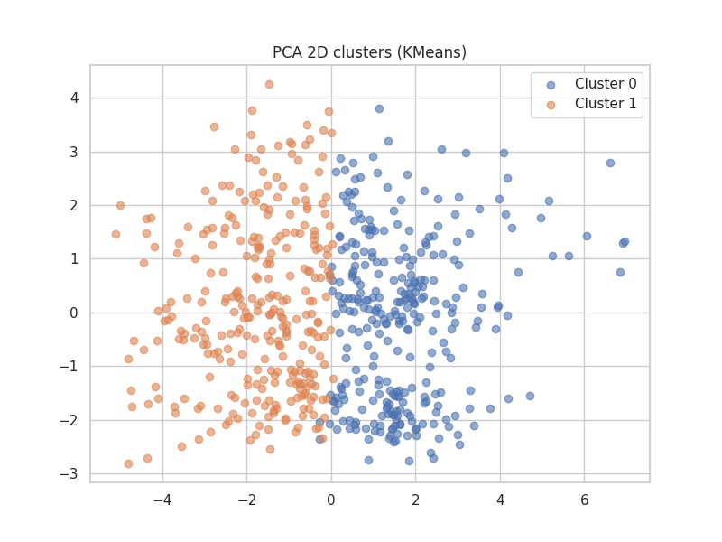

# Amazon Customer Segmentation Analysis



## Project Overview
This project performs customer segmentation on Amazon customer data using K-means clustering with PCA. The analysis reveals distinct customer segments based on shopping behavior, preferences, and demographics.

## Key Findings

### Optimal Clusters
- **Number of Clusters**: 2 (determined by elbow method and silhouette analysis)
- **Silhouette Score**: 0.094
- **Davies-Bouldin Index**: 2.91
- **Calinski-Harabasz Index**: 69.49

### Cluster Sizes
| Cluster | Customers | Percentage |
|---------|-----------|------------|
| 0       | 303       | 50.3%      |
| 1       | 299       | 49.7%      |

### Cluster Characteristics
- **Cluster 0**: Slightly older (avg. age 31.1) with preference for Beauty and Personal Care products
- **Cluster 1**: Slightly younger (avg. age 30.5) with more diverse category preferences

## Project Structure
```
ML MINI PROJ/
├── outputs/                 # Analysis outputs
│   ├── pca_clusters.png     # 2D visualization of clusters
│   ├── elbow.png           # Elbow method plot
│   ├── silhouette.png      # Silhouette analysis
│   └── clustering_results_summary.json  # Complete metrics
├── clustering-amazon-customers-pca-k-means.ipynb  # Main analysis
└── requirements.txt         # Dependencies
```

## Getting Started

1. **Setup Environment**
   ```bash
   python -m venv .venv
   \.venv\Scripts\activate
   pip install -r requirements.txt
   ```

2. **Run the Analysis**
   Open and execute `clustering-amazon-customers-pca-k-means.ipynb` in Jupyter Notebook.

## Dependencies
- Python 3.8+
- pandas
- scikit-learn
- matplotlib
- seaborn
- jupyter

## Results
Detailed analysis and visualizations are available in the `outputs` directory and the Jupyter notebook.

## License
Educational use only.
